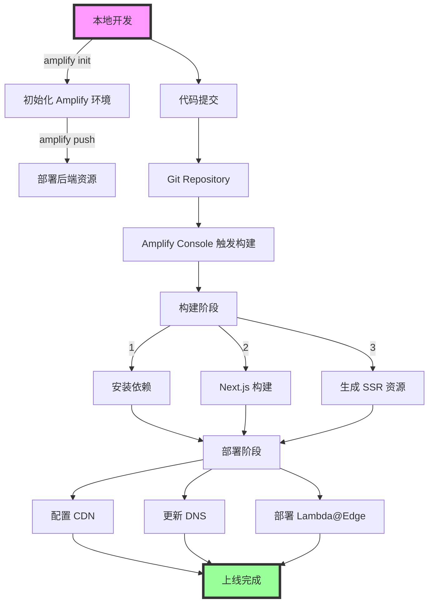
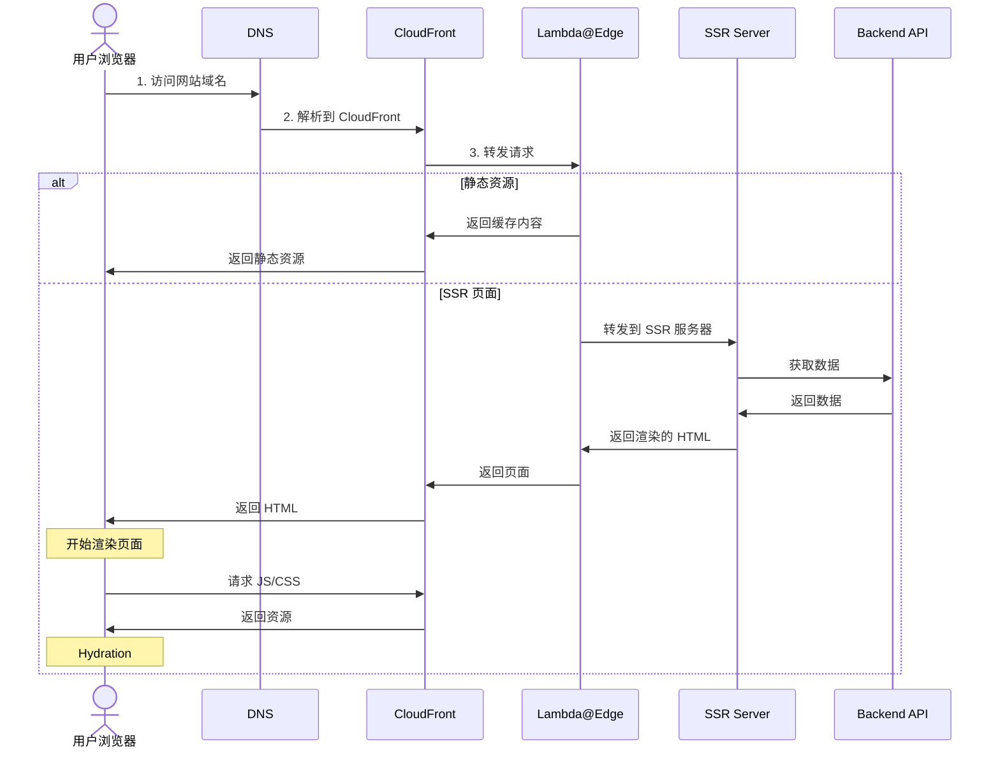

# 基于 AWS Serverless 的 Next.js SSR 服务

## 目录
- [基于 AWS Serverless 的 Next.js SSR 服务](#基于-aws-serverless-的-nextjs-ssr-服务)
  - [目录](#目录)
  - [前言](#前言)
  - [SSR 框架选型对比](#ssr-框架选型对比)
  - [为什么选择 Next.js？](#为什么选择-nextjs)
  - [AWS Serverless 部署方案](#aws-serverless-部署方案)
  - [AWS Amplify 详解](#aws-amplify-详解)
  - [Amplify 工作流程](#amplify-工作流程)
  - [项目创建](#项目创建)
    - [使用官方模板创建](#使用官方模板创建)
    - [手动创建](#手动创建)
    - [aws 控制台创建项目](#aws-控制台创建项目)
  - [amplify 部署流程](#amplify-部署流程)
  - [Next.js + Amplify 请求流程](#nextjs--amplify-请求流程)
  - [总结](#总结)

## 前言
书接上文，本文将讲解如何搭建一个基于 Serverless 架构的 Next.js SSR 服务。

## SSR 框架选型对比

目前业界主流的 SSR 框架有以下几种选择，我们一一对比：

| 框架 | 主要特点 | 优势 |
|------|----------|------|
| Next.js | • 基于 React 生态系统 • 完善的组件和工具生态 • 最活跃的社区支持 | • 快速的迭代更新 • 较低的学习门槛 • 人才市场充足 |
| Remix | • 基于 React 生态 • 优秀的服务器端渲染支持 | • 基于 Web 标准和 HTML Form • 数据加载和突变的新方案 |
| Astro | • 支持多框架组件 • Islands 架构设计 | • 极致的页面加载性能 • 默认静态站点生成 |
| Qwik | • 零 Hydration 设计 • 基于用户交互的按需加载 | • 极快的页面加载速度 |

## 为什么选择 Next.js？

对于企业级应用，Next.js 通常是更优的选择，原因如下：

1. 相比 Remix：生态系统更加完善、框架更加成熟稳定、社区支持更强、灵活性更强

2. 相比 Astro：astro动静分离的设计，固然支撑了它的高性能，但在复杂交互场景下，开发人员心智负担会极重。处理不好会导致性能下降

3. 相比 Qwik：React 生态优势、在复杂交互场景下，qwik 的 0 hydration 设计，反而会因为频繁的js加载，导致性能下降

## AWS Serverless 部署方案

选定Next.js 后，就要考虑如何部署，在 AWS 上部署 Next.js 服务，主要有以下几种方案：

| 方案 | 特点 | 适用场景 | 难度 |
|------|------|----------|------|
| AWS Amplify | • 低门槛，配置简单 • 集成多项 AWS 服务 • 开箱即用 | • 快速启动和开发 • 适合初学者 | ⭐️⭐️ |
| AWS SAM | • 更灵活的架构控制 • 模板化搭建云资源 | • 适合进阶开发者 • 需要深入理解 AWS 架构 | ⭐️⭐️⭐️ |
| AWS CDK | • 基于代码的基础设施 • 完整的架构掌控 • IAC 基础设施即代码 | • 适合专业开发团队 | ⭐️⭐️⭐️⭐️ |

## AWS Amplify 详解

AWS Amplify 是官方提供的 Serverless 开发框架，集成了多项 AWS 服务：

| 服务 | 用途 |
|------|------|
| Cognito | 用户认证 |
| S3 | 静态资源存储 |
| CloudFront | 内容分发加速 |
| Lambda | 服务器函数 |
| API Gateway | API 网关 |
| DynamoDB | 数据库存储 |

## Amplify 工作流程

## 项目创建
### 使用官方模板创建
> 建议先使用官方模板创建，跟着官方demo理解，再进行手动创建。
> 
可以使用官方模板创建，它集成了一些常用的功能，例如鉴权、数据库、静态资源存储等。
克隆官方模板链接[amplify-next-template](https://github.com/aws-samples/amplify-next-template)

### 手动创建
> 熟悉后使用nextjs脚手架，项目干净可控，尽量不使用额外的功能，后续可以迁移到sam或者cdk。

直接使用nextjs脚手架创建项目，然后使用amplify 进行配置。

### aws 控制台创建项目
> 推荐使用aws 控制台创建，简单快捷，适合快速上手。

- 在aws 控制台中创建一个amplify 项目
- 选择对应的项目
- 点击下一步，项目会自动部署
- 部署完成后，控制台会出现项目cloudfront链接，点击链接，即可访问项目
- 如果需要自定义域名，控制台-托管-自定义域-添加域进行操作即可
- 到了这一步，一个完整的ssr项目就创建完成了，一个自动扩容不怕高并发的项目就搭建完成了

具体操作，参考[amplify 官方文档](https://docs.amplify.aws/react/start/quickstart/)。
其中还有直连数据库，鉴权等操作。如果作为一个ssr项目，通常逻辑都是转发对应接口到后端网关去实现的，amplify 更适合作为前端项目，后端网关我们可以使用其他方案实现，例如 sam
除了支持Next.js 外，还支持React、Vue、Angular、Svelte 等框架。

## amplify 部署流程
以下是amplify 部署流程示意图

## Next.js + Amplify 请求流程
以下是Next.js + Amplify 请求流程示意图

## 总结
熟悉了amplify 的部署流程，以及Next.js + Amplify 请求流程。开始基于amplify 进行项目开发。
下一步，理解aws上的各种好用的云资源，例如cognito、s3、cloudfront、lambda、api gateway、dynamodb等。有了这些概念，可以更好帮助我们理解更工程化的serverless 架构。

---
*本文完*