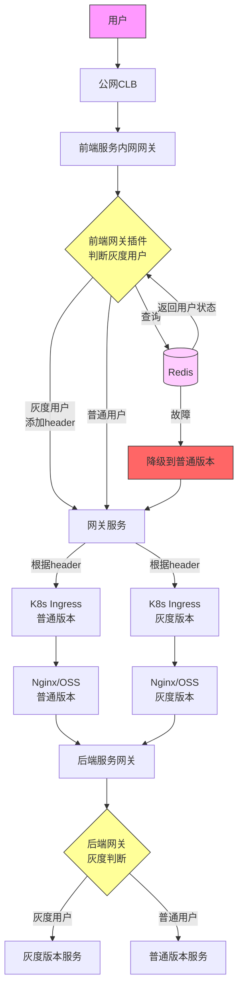
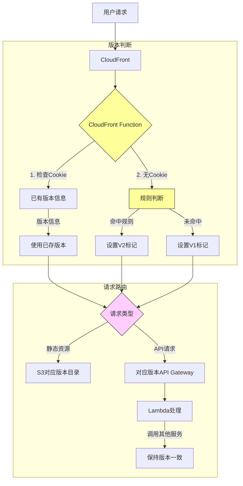
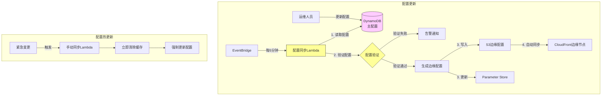
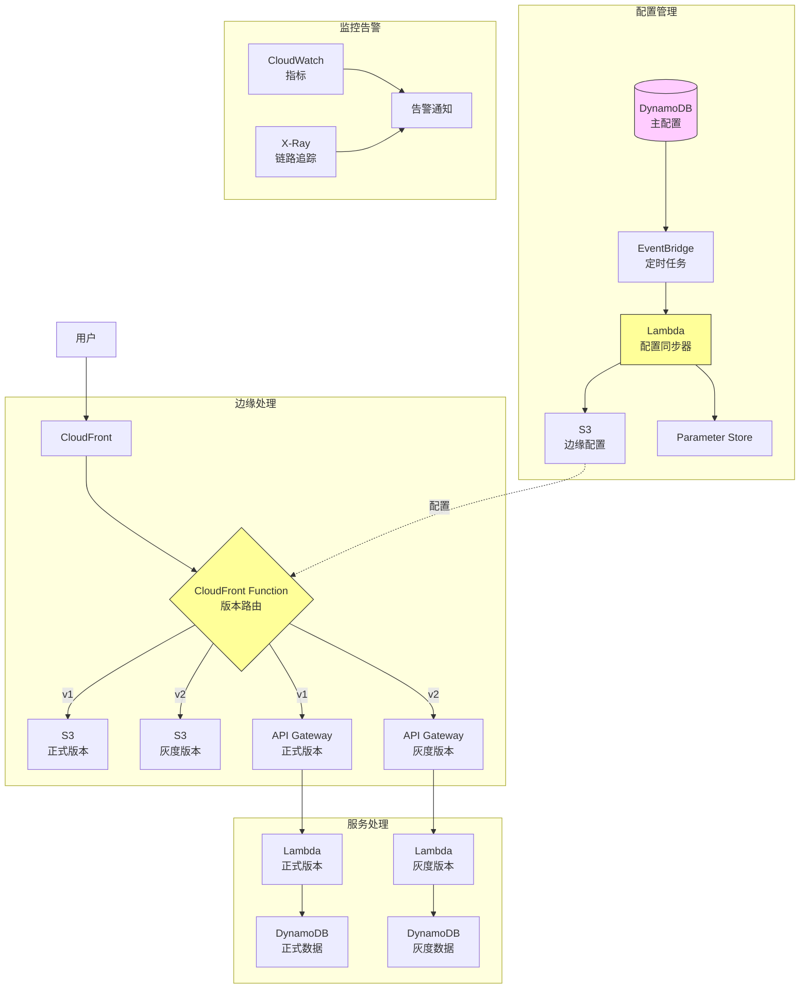

# 基于传统云的灰度与AWS灰度

## 目录
- [基于传统云的灰度与AWS灰度](#基于传统云的灰度与aws灰度)
  - [目录](#目录)
  - [概述](#概述)
  - [传统云灰度](#传统云灰度)
    - [请求链路](#请求链路)
  - [AWS Serverless灰度](#aws-serverless灰度)
    - [请求链路](#请求链路-1)
    - [配置同步](#配置同步)
    - [完整架构](#完整架构)
  - [对比分析](#对比分析)
  - [总结](#总结)

## 概述
对于企业级的应用，灰度发布是必不可少的一环，下面基于传统云和AWS的serverless架构的全链路灰度链路实现，展开进行讨论。

想要实现一个灰度发布，通常需要考虑以下几个方面：
1. 请求链路：
    - 请求从哪来？
    - 中间经过了哪些服务最终到达目标服务
    - 前后端请求的链路有什么异同
2. 灰度用户识别：
    - 怎么识别灰度用户
    - 如何配置灰度规则
3. 配置同步：如何同步灰度配置
4. 请求转发：如何转发到对应版本

梳理清楚上述几个方面，基本就能实现一个灰度发布，下面基于传统云和AWS的serverless架构的灰度链路实现，展开进行讨论。

## 传统云灰度
### 请求链路
传统的k8s架构，请求链路基本雷同。这里以我司的架构为例，进行说明。

常规访问链路如下：
用户访问域名=》dns解析=》公网CLB=》内网网关=》对应服务k8s ingress => 对应k8s前端服务，可能是nginx，也可能是nginx+oss
如果是后端服务，会通过前端网关，将请求转发到后端网关，某些特定的后端服务，可能直接在前端服务的nginx进行转发到指定的服务上。

弄清楚了常规访问链路，灰度访问链路就很简单了：
1. 环境拆分：区分出灰度环境，和普通环境
2. 配置同步：基于redis，将灰度用户信息同步到网关
3. 灰度用户识别：基于网关判断用户标识
4. 请求转发：基于网关，将灰度用户请求转发到灰度服务，普通用户请求转发到普通服务

基于上述步骤，灰度访问链路如下：

## AWS Serverless灰度
AWS serverless访问链路如下：
- 静态资源: 用户访问域名=》dns解析=》cloudfront=》s3
- api请求: 用户访问域名=》dns解析=》cloudfront=》api gateway=》lambda

区别于传统云，AWS serverless架构的灰度可以层级会更少，因为cloudfront提供了丰富的功能，它既是cdn，又是边缘计算节点，还能缓存数据。cloudfront的特性，我能可以设计一个高性能且少层级的灰度架构:

1. 环境拆分：serverless通常是多环境，比如正式环境，灰度环境，测试环境，开发环境，通常是基于不同的域名进行区分
2. 配置同步：
    - 基于dynamodb维护灰度配置
    - 利用 eventBridge 可以定时调用 lambda 将灰度配置分发到cloudfront的边缘节点缓存
3. 灰度用户识别：基于cloudfront function + 边缘节点缓存，可以实现边缘节点判断灰度用户，无需经过api gateway
4. 请求转发：cloudfront自带请求转发，使用cloudfront function，可以轻松实现请求转发到对应的版本

### 请求链路

### 配置同步
利用cloudfront的边缘节点的储存，可以实现配置边缘化，减少请求的延迟：
- dynamodb维护主配置
- eventBridge定时调用lambda，将主配置同步到边缘节点
- 边缘节点缓存配置，实现配置边缘化

### 完整架构
以下是基于AWS serverless架构的灰度发布完整架构图：

## 对比分析
下表对比了传统云和AWS Serverless灰度发布的主要特点：

| 对比维度 | 传统云灰度 | AWS Serverless灰度 |
|---------|------------|-------------------|
| 架构复杂度 | 较复杂，多层网关和服务 | 相对简单，层级较少 |
| 配置管理 | 基于Redis存储和同步 | DynamoDB + 边缘节点缓存 |
| 灰度判断位置 | 网关层 | CloudFront边缘节点 |
| 请求延迟 | 需经过多层网关，延迟较高 | 边缘节点判断，延迟低 |
| 运维成本 | 需要维护网关集群和Redis | Serverless架构，运维成本低 |
| 扩展性 | 需要手动扩容 | 自动弹性伸缩 |
| 容灾能力 | 依赖Redis可用性 | 边缘节点分布式架构，高可用 |
| 费用模型 | 固定成本+弹性成本 | 按使用付费 |

## 总结
基于AWS serverless架构的灰度发布，可以实现高性能且少层级的灰度架构，利用cloudfront的边缘节点的储存，可以实现配置边缘化，减少请求的延迟。

本章只是介绍了灰度发布的基本实现，实际开发中，还有需要概念并未介绍到。例如 lambda 的权限管理，cloudfront function 的权限管理，cloudfront 的缓存策略，cloudfront 的监控告警等。以后章节中再进行详细介绍。
