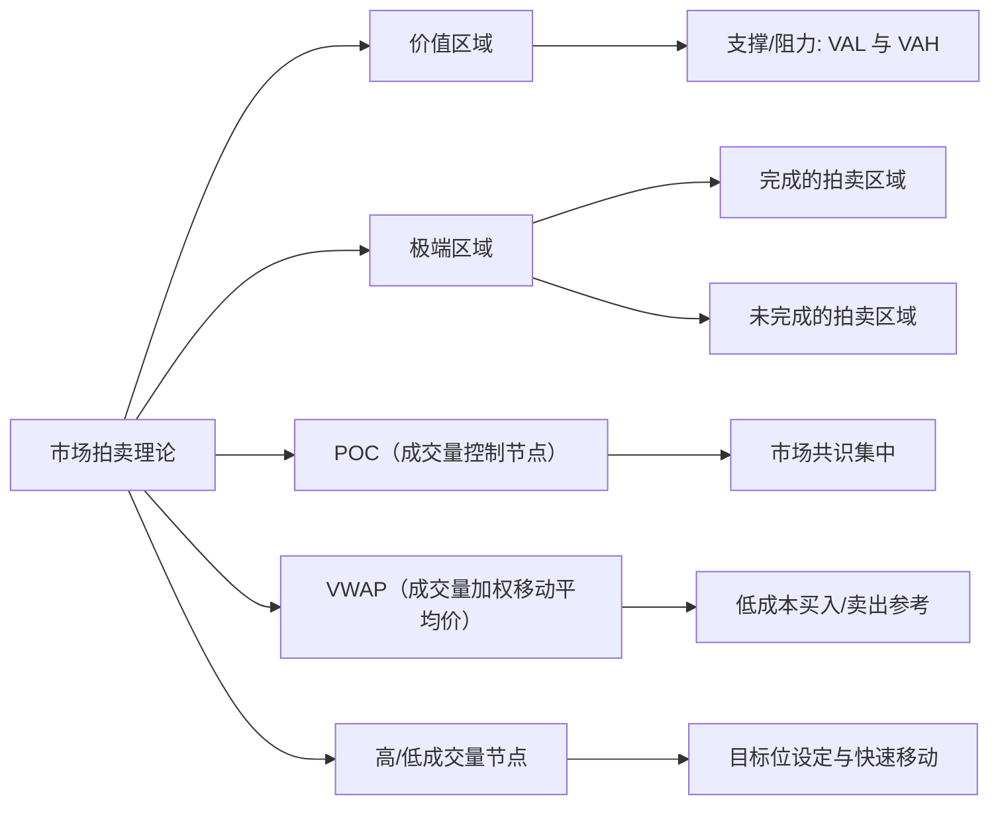
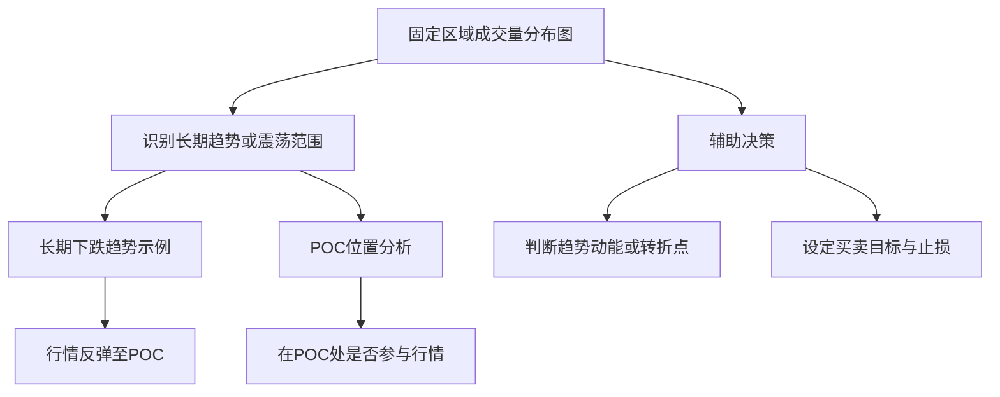

# 威科夫学习笔记

本文总结了基于市场拍卖理论的成交量分布图相关知识，重点介绍了各个区域的意义和应用方法。同时，为了让思路更清晰，文中还嵌入了 **Mermaid** 图表来帮助你理解整体结构。
## 威科夫理论
市场要形成结果（趋势），必须有一个原因（积累/分配）
## 价格与成交量

### 日内交易
做日内交易，需要有对比的分析价格和成交量。
交易活跃时的价格和成交量，与交易不活跃时的价格和成交量，进行对比
### 价格移动
某些时候，由于成交量较少，价格上涨只需要很少的成交量
### 扩散理论
市场分为4个阶段
1. 累积阶段
2. 上升趋势
3. 派发阶段
4. 下降趋势

威科夫体系是为了分析早期趋势，以在趋势形成早期介入

### 市场趋势
市场大部分时间都处在平衡期，小部分时间产生趋势（这里是累积和派发出现的地方）。也是威科夫理论的重点
### 价值认知
> 市场循环

所有横向发展在参与者之间不再达成一致时结束。
而纵向发展会在价格再次达成一致时结束。
这就是市场循环，可以根据这种观点建立交易策略

### 市场运动的四个环节
1. 趋势阶段：垂直发展，价格处于失衡状态。价格单向移动
2. 停止阶段：开始大量反向交易，之前趋势运动开始停滞
3. 震荡阶段：横向发展，在价格停止的地方和新的平衡区间交易
4. 转换阶段：价格离开区间，再次产生失衡。这种行为可能是逆转，也可能延续之前的趋势

### 威科夫理论的五个阶段
A. 趋势停止
B. 原因构建
  - 处于震荡期间
C. 评估对手
  - 尝试突破当前价值区域
  - 突破后，会有回调，回调到价值区域时，会再次测试（这是一个关键点）
  - 如果突破失败，会继续构建原因
  - 突破成功，会展开趋势
D. 趋势展开
E. 方向确认
  - 趋势展开后，会有一个回调，来确认市场对该趋势的认可

### 订单流的问题
把委卖栏中执行的所有订单都归结为主动买入，委买栏的归结为主动卖出。
这个判断是主观的，如果止损买入和限价卖出的订单匹配，显示为主动买入。但是双方会退出市场。
订单流的分析在这里就会失效

在使用订单流时，合理的做法是将分析置于一个合理框架下。例如威科夫理论
因为订单匹配的复杂兴致，失衡会在图形各处出现，结合其他分析框架会得到更有意义的结果

独立使用订单流交易工具是没有意义的，因为它不能给我们提供市场上最重要的确定因素：市场背景
## 成交量分布图

它基于市场拍卖理论原则，能够确定市场中交易者最感兴趣的区域，进而识别价格在不同区间的支撑、阻力及潜在的突破走势。

从上述结构图可见，成交量分布图与"市场拍卖理论"有紧密关联；不同的关键概念互相补充，帮助我们更好地理解市场中的支撑、阻力和交易机会。

## 价值区域

### 定义

价值区域（Value Area）是成交量分布图中成交量较为集中的区间，其边界通常用 VAL（Value Area Low，价值区域下边界）和 VAH（Value Area High，价值区域上边界）来表示。

### 意义

* 支撑与阻力：
  * 当价格接近 VAL 可能得到支撑
  * 当价格接近 VAH 可能受到阻力
* 市场共识：
  * 价值区域是市场认为相对"公平"的价格带
  * 价格常常在此区间波动形成震荡
  * 一旦突破或跌破，则预示可能的趋势变化

## 极端区域

### 定义与应用

当价格向某一边移动时，如果成交量持续减少，表明该端点已经完成了"拍卖"（完成的拍卖区域）。反之，如果在末端出现高成交量，则说明市场在这里还没有达成共识（未完成的拍卖区域）。

### 意义

* 完成的拍卖区域：价格可能延续当前趋势，也可能在远离拍卖完成区后找到新的平衡区间
* 未完成的拍卖区域：往往表现出异常行情，一旦触及此区域或被快速突破或反弹，带来更大的不确定性或波动

## 成交量控制节点（POC）

### 定义

POC（Point of Control）是成交量分布中成交量最为集中的单个价格点，体现了市场的主要共识。

### 意义

* 市场共识集中：价格在接近 POC 时，买卖双方都可能加强防守或进攻，市场容易出现震荡或反复
* 交易回避区：由于在 POC 附近博弈激烈，交易者通常避免在此轻易进场或离场，以防止在震荡中被洗出

## 成交量加权移动平均价（VWAP）

### 定义

VWAP（Volume Weighted Average Price）是指在某一时间段内，根据成交量加权的平均成交价格。

### 意义

* 机构关注：大型机构交易者常用 VWAP 作为衡量"平均买卖成本"的指标
* 交易参考：
  * 当价格低于 VWAP 时，买入成本较低
  * 当价格高于 VWAP 时，卖出可能更为有利

## 高/低成交量节点

### 高成交量节点

#### 定义
在成交量分布图中，累计成交量较为突出的价位区间，代表了市场曾在该区域形成强烈共识。

#### 意义
* 吸引力强：价格若偏离这一节点后，容易被迅速拉回或再次聚集于此
* 目标位设定：在趋势或震荡行情中，高成交量节点往往充当下一目标位或重要参考点

### 低成交量节点

#### 定义
累计成交量明显较少的价位区间，说明市场对该区域缺乏持续性共识。

#### 意义
* 价格快速穿越：价格到达该区域时，往往能快速突破或回落，因为缺乏交易者关注或承接
* 非主要支撑/阻力：市场通常不会在此形成长期的止跌或反弹

## 固定区域成交量分布图

除了整体的市场分布分析，还可以针对特定区间或特定时间段绘制成交量分布图，以便更精准地研究趋势与震荡。

### 应用案例

* 当我们发现价格在长期下跌趋势中，我们可以通过固定区域成交量分布图找到该段下跌区间的 POC
* 如果后市价格出现反弹，我们可以观察 POC 的支撑或阻力表现，再结合其它技术指标，判断是否有参与趋势性交易的机会

## 总结

成交量分布图及其各组成部分（价值区域、极端区域、POC、VWAP、高/低成交量节点）为我们理解市场行为提供了直观的工具。通过识别市场共识区和异常区域，可以更好地判断价格在未来走势中的支撑、阻力和突破信号，从而辅助交易决策。