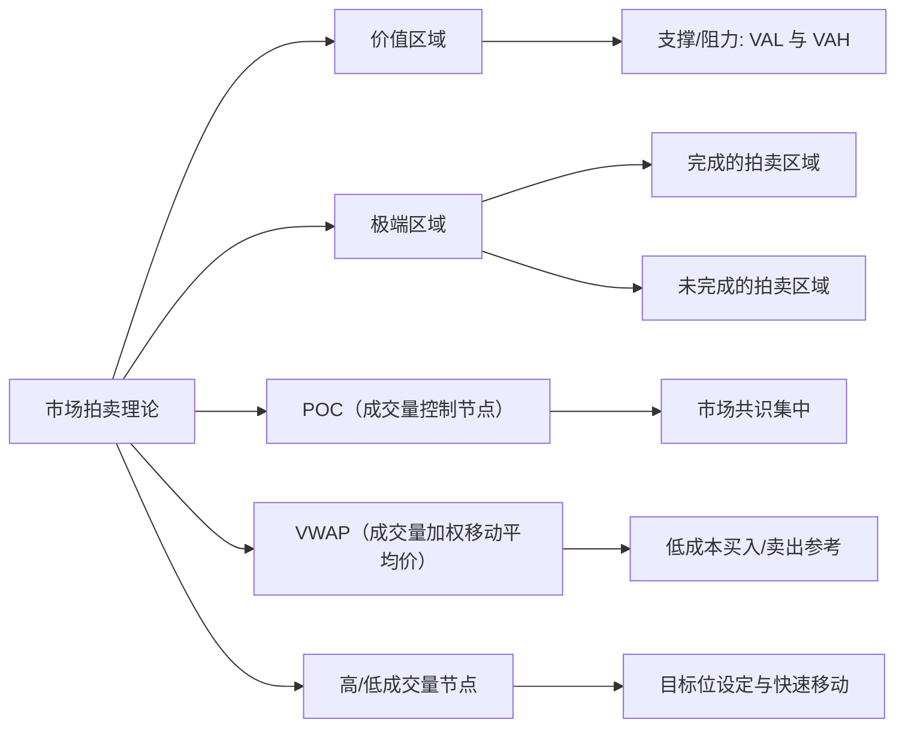
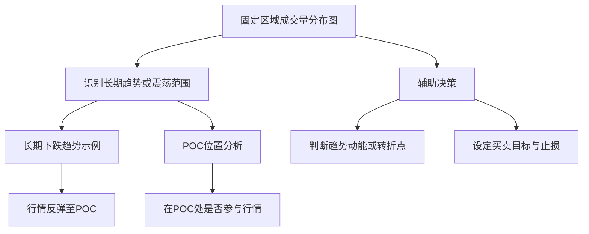

# 威科夫学习笔记

本文总结了基于市场拍卖理论的成交量分布图相关知识，重点介绍了各个区域的意义和应用方法。同时，为了让思路更清晰，文中还嵌入了 **Mermaid** 图表来帮助你理解整体结构。
## 威科夫理论
市场要形成结果（趋势），必须有一个原因（积累/分配）
## 价格与成交量

### 日内交易
做日内交易，需要有对比的分析价格和成交量。
交易活跃时的价格和成交量，与交易不活跃时的价格和成交量，进行对比
### 价格移动
某些时候，由于成交量较少，价格上涨只需要很少的成交量
### 扩散理论
市场分为4个阶段
1. 累积阶段
2. 上升趋势
3. 派发阶段
4. 下降趋势

威科夫体系是为了分析早期趋势，以在趋势形成早期介入

### 市场趋势
市场大部分时间都处在平衡期，小部分时间产生趋势（这里是累积和派发出现的地方）。也是威科夫理论的重点
### 价值认知
> 市场循环

所有横向发展在参与者之间不再达成一致时结束。
而纵向发展会在价格再次达成一致时结束。
这就是市场循环，可以根据这种观点建立交易策略

### 市场运动的四个环节
1. 趋势阶段：垂直发展，价格处于失衡状态。价格单向移动
2. 停止阶段：开始大量反向交易，之前趋势运动开始停滞
3. 震荡阶段：横向发展，在价格停止的地方和新的平衡区间交易
4. 转换阶段：价格离开区间，再次产生失衡。这种行为可能是逆转，也可能延续之前的趋势

### 威科夫理论的五个阶段
A. 趋势停止
B. 原因构建
  - 处于震荡期间
C. 评估对手
  - 尝试突破当前价值区域
  - 突破后，会有回调，回调到价值区域时，会再次测试（这是一个关键点）
  - 如果突破失败，会继续构建原因
  - 突破成功，会展开趋势
D. 趋势展开
E. 方向确认
  - 趋势展开后，会有一个回调，来确认市场对该趋势的认可

### 订单流的问题
把委卖栏中执行的所有订单都归结为主动买入，委买栏的归结为主动卖出。
这个判断是主观的，如果止损买入和限价卖出的订单匹配，显示为主动买入。但是双方会退出市场。
订单流的分析在这里就会失效

在使用订单流时，合理的做法是将分析置于一个合理框架下。例如威科夫理论
因为订单匹配的复杂兴致，失衡会在图形各处出现，结合其他分析框架会得到更有意义的结果

独立使用订单流交易工具是没有意义的，因为它不能给我们提供市场上最重要的确定因素：市场背景

## 拍卖理论与成交量分布
成交量分布使用了拍卖理论的原则，在图形上对关键区域进行可视化。通过对关键区域的成交量进行统计。对产生在特定区域的交易行为进行判断

它能确定市场中，交易者最感兴趣的区域，同时评估价格在当前区域是被接受还是被拒绝

市场是有记忆的，倾向重复以前的行为，因此可预期，在某些重要位置会出现过去相同的价格行为

但是市场记忆大多是短期的，新的交易区域比旧的交易区域更重要。如果价格发生了失衡，首先要考虑的区域是最近的平衡区域

价格离开某个特定区域时间越长，它的意义越小。如果没有其他区域参考。这个区域就任然具有参考价值，因为市场首先要寻找的很可能是最近的平衡区域
## 成交量分布图

它基于市场拍卖理论原则，能够确定市场中交易者最感兴趣的区域，进而识别价格在不同区间的支撑、阻力及潜在的突破走势。

从上述结构图可见，成交量分布图与"市场拍卖理论"有紧密关联；不同的关键概念互相补充，帮助我们更好地理解市场中的支撑、阻力和交易机会。

## 价值区域

### 定义

价值区域（Value Area）是成交量分布图中成交量较为集中的区间，其边界通常用 VAL（Value Area Low，价值区域下边界）和 VAH（Value Area High，价值区域上边界）来表示。

### 意义

* 支撑与阻力：
  * 当价格接近 VAL 可能得到支撑
  * 当价格接近 VAH 可能受到阻力
* 市场共识：
  * 价值区域是市场认为相对"公平"的价格带
  * 价格常常在此区间波动形成震荡
  * 一旦突破或跌破，则预示可能的趋势变化

## 极端区域

- 完成的拍卖区域
    - 作为一个历史参考点，突破这个参考点，表示过去的共识已经失效
    - **固定的参考窗口**
        - 当我们定义一个“完成的拍卖区域”时，我们实际上是在选定一个特定的时间段或数据窗口内，基于那段时间的成交量分布得出的结果。这个区域代表了在那段时间内市场对价格的共识。
    - 这个参考区域在计算出来之后，即便市场后续发生变化，它仍然可以作为一个历史参照点。换句话说，突破这一既定区域，说明市场已经离开了之前的共识区间。
- 策略： 基于旧的参考区域，如果突破了原来的极端区域，构建新的价格共识时。可以使用动态的时间窗口观察交易量
    - 在加密货币市场，由于波动性较大、交易活跃，较短的时间窗口（如15-30分钟）可能会更有用，因为它能及时反映市场快速变化。
    - 利用历史数据进行回测，比较不同时间窗口下新成交量分布的反应效果，看看哪种窗口更适合捕捉支撑或阻力的建立。
    - 同时，在实盘交易中不断调整，确保所选时间范围既能及时反映市场共识的变化，又不会因数据过少而导致误判。
- 未完成的拍卖区域
    - 这里依然伴随高成交量，表明市场在此价格没有达成共识
    - 当价格触及这一层级，可能引发剧烈反应，如果市场情绪突然倾向某个方向，可能出现快速突破，或强烈反弹
    - 在这个区域需要采取更紧密的止损策略。防止价格迅速逆转

## 成交量控制节点（POC）

### 定义

POC（Point of Control）是成交量分布中成交量最为集中的单个价格点，体现了市场的主要共识。

### 意义

* 市场共识集中：价格在接近 POC 时，买卖双方都可能加强防守或进攻，市场容易出现震荡或反复
* 交易回避区：由于在 POC 附近博弈激烈，交易者通常避免在此轻易进场或离场，以防止在震荡中被洗出
* 次级区域（某个区域内，次于poc的高成交量区域）
    
    当次级区域积累到足够的成交量并转变为新的 POC，这不仅标志着市场共识的变化，也为交易者提供了重要的趋势确认和支撑/阻力参考信号。这时，应及时调整交易策略和风险管理，适应市场结构的新变化。

## 成交量加权移动平均价（VWAP）

### 定义

VWAP（Volume Weighted Average Price）是指在某一时间段内，根据成交量加权的平均成交价格。

### 意义

* 机构关注：大型机构交易者常用 VWAP 作为衡量"平均买卖成本"的指标
* 交易参考：
  * 当价格低于 VWAP 时，买入成本较低
  * 当价格高于 VWAP 时，卖出可能更为有利

## 高/低成交量节点

### 高成交量节点

#### 定义
在成交量分布图中，累计成交量较为突出的价位区间，代表了市场曾在该区域形成强烈共识。

#### 意义
* 吸引力强：价格若偏离这一节点后，容易被迅速拉回或再次聚集于此
* 目标位设定：在趋势或震荡行情中，高成交量节点往往充当下一目标位或重要参考点

### 低成交量节点

#### 定义
累计成交量明显较少的价位区间，说明市场对该区域缺乏持续性共识。

#### 意义
* 价格快速穿越：价格到达该区域时，往往能快速突破或回落，因为缺乏交易者关注或承接
* 非主要支撑/阻力：市场通常不会在此形成长期的止跌或反弹

## 固定区域成交量分布图

除了整体的市场分布分析，还可以针对特定区间或特定时间段绘制成交量分布图，以便更精准地研究趋势与震荡。

### 成交量分布的形状

趋势和震荡有两种常见模式，b和p模式

这两种模式，提示我们趋势的开始停止以及震荡的开始

- p型：先上涨，后震荡P 展示多头力量
    - 价值区域在上方
    - 代表未来的派发结构和在次积累结构
- b型。先下跌，后震荡d 展示多头力量
    - 价值区域在下方
    - 代表未来的积累结构和再次派发结构
    - 在长期下跌的趋势背景中，它们将会出现再次派发的特征。这里是参与下降趋势的绝佳机会
    - 如果在长期上涨的趋势中观察到一个b型结构的成交量分布。它可能预示着上涨趋势的结束，有时也预示着一个新的下跌趋势的开始
- d型：市场还没有明确的价格共识，处于震荡阶段
# 成交量分布的应用
### 结构识别
- 如果发下发展中的结构中出现了失衡。可以绘制一个成交量分布图，确定测试价位，寻找价格运动的延续性。价格突破之后，测试会在价值区域的上端进行的，如果是下跌突破，就在下端。这的测试是多头入场的机会
- 成交量分布图的范围应包括从行情震荡开始，直到失衡发生前的所有价格波动

### 判断市场偏差
- 交易区域分析
    - 倾向在最后一个高成交量节点产生的方向傻瓜进行交易，只有价格打破最后一个高成交量区域的支撑时。我们才会进行反向交易
    - 高成交量节点被打破：价格从这个最后的高成交量节点移动到另一个高成交量节点

### 交易点位分析
- 弹簧效应
    - 如果潜在弹簧效应后，价格没有回到成交量加权移动平均价之上。我们的预期就会发生变化。这种缺乏上涨力量的情况。表明空方对市场的控制
    - 弹簧效应后，如果没法回到价值区域低点和成交量加权移动平均价上。这是一个明显的弱势指标。我们将这种模式视为派发行为
### 分析趋势健康程度

当观察到一个上涨的趋势时，价值区域（包括poc）越来越高是趋势健康的表现。这表明价格正在被新的价格区域所接受。改趋势可能会延续。这是一个做多的机会

如何观察

- 观察几个价值区域之间的重叠区域的交易成交量分布图
    - 如果连续下跌出现bp形态，意味着下跌的结束
    - 如果连续上涨出现pb，意味上涨结束
        - 就算pb不是连续出现的也具有意义

如果前期的趋势运动耗费了太多时间，那么我们应该质疑趋势运动的健康性
### 成交量控制点的移动

poc的移动有两个意义，趋势的延伸或者趋势的反转

由于无法事先直到是哪种情况。最好为两种情况都做准备

- 有利于反转的规则
    - 如果之前的趋势是健康的，能够看到新的趋势的展开。且不需要耗费太多时间
    - 无延续性：poc移动后，价格没能超前一个方向运行，需要质疑价格的延续性
    - 时间消耗：poc移动后，价格没有朝着之前方向继续运行，等待时间越长，就越有可能发生市场反转，而不是延续之前的行情
    - 市场特征的改变：poc移动后，如果出现震荡，在反方向出现了快速回调，可以认为是反转的开始
    - 交易计划：等待进入价值区域两端，如果在下方，就在价值区域低点做多，上方则相反
    - 并不是所有反转行情都会遵守上述规则
- 有利于趋势延续性的规则
    - 延续性判断相对简单
    - poc移动后，价格会以一定的速度开始新的趋势，继续向该方向移动，耗费时间较少

### 对于交易头寸的修改

- 入场：无论在趋势行情还是震荡行情中，都应该主要参考下边的几个点
    1. 成交量加权移动平均价
    2. poc
    3. 价值区域高低点
    4. 当价格回到上述区域时，通常意味着市场在这些位置有一定的支撑或阻力作用，这时可以视作触发入场信号，从而建立仓位
- 止损：
    - 确定之前拒绝的价格区域，价格在这些区域发生了反转，未来价格在这里也会有同样的走势。所以这里是放置止损单的区域。因为这里价格会及时反转，可以防止损失扩大
    - 除了低成交量节点，还希望支持的入场点位越多越好
    - 止损区是一片具有较高历史支撑性的区域，可以避免止损的滑点
- 止盈：
    - 寻找流动性充沛的区域，高成交量节点会对价格产生磁力，是很好的目标位

## 价值区域交易原则

### 区间交易原则

如果价格还在前一天价值区域内。表明市场维持在平衡状态。就可以在价值区域的两侧等待价格反转

这种反转行情，最低目标是回到价格控制区，较高目标是完全穿越价值区，并达到价值区另一侧

### 反转交易规则

如果价格成功进入了一个价值区域，它很可能会到达价值区域的另一端。

日内交易一般会看前一天的价值区域。作为参考坐标

### 应用案例

* 当我们发现价格在长期下跌趋势中，我们可以通过固定区域成交量分布图找到该段下跌区间的 POC
* 如果后市价格出现反弹，我们可以观察 POC 的支撑或阻力表现，再结合其它技术指标，判断是否有参与趋势性交易的机会

## 总结

成交量分布图及其各组成部分（价值区域、极端区域、POC、VWAP、高/低成交量节点）为我们理解市场行为提供了直观的工具。通过识别市场共识区和异常区域，可以更好地判断价格在未来走势中的支撑、阻力和突破信号，从而辅助交易决策。